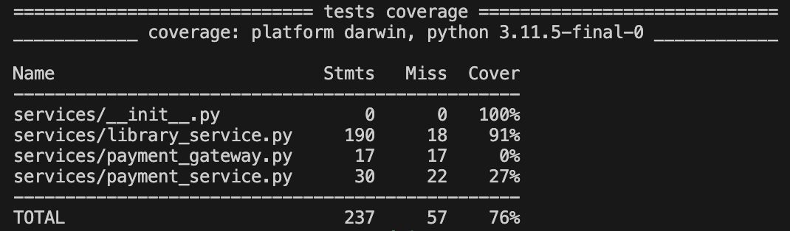
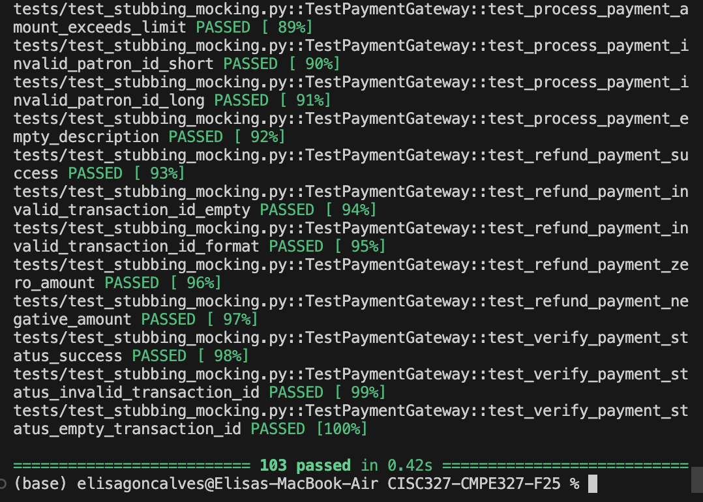
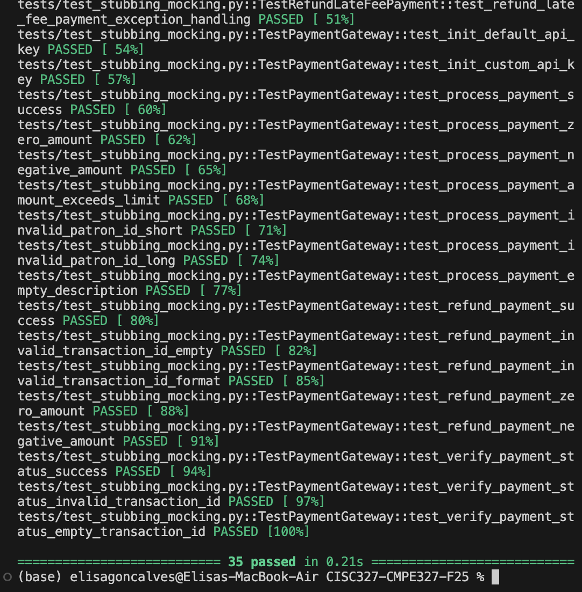
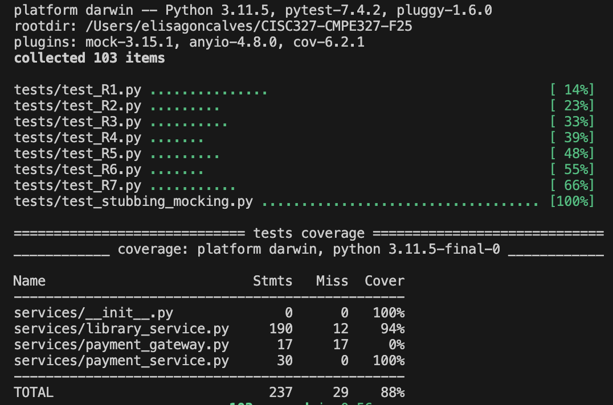

# Assignment 3 Report

**Name:** Elisa Goncalves  
**Student ID:** 20390874
**Github Link**: https://github.com/elisareineg/cisc327-library-management-a2-20390874

---

## Section 2 - Stubbing vs Mocking Explanation (200-300 words)

### Definitions

**Stubbing** is a testing technique where we replace real function implementations with fake implementations that return hard-coded values. Stubs provide predetermined responses without verifying how they are called. In this assignment, I used `mocker.patch()` from pytest-mock to stub functions like `calculate_late_fee_for_book()` and `get_book_by_id()`. These stubs return fake data (dictionaries with fee amounts, book information) that allow our tests to run without depending on the actual database or complex business logic. Stubs are useful when we only need the return values and don't care about how the function was called.

**Mocking** is a testing technique where we create test doubles that not only return fake values but also verify interactions. Mocks record how they are used and allow us to make assertions about method calls, arguments, and call counts. In this assignment, I used `Mock(spec=PaymentGateway)` from unittest.mock to create mocks of the payment gateway. Unlike stubs, mocks must be verified using methods like `assert_called_once()`, `assert_called_with()`, and `assert_not_called()`. This ensures that the payment gateway methods are called with correct parameters and the correct number of times.

### Strategy

For `pay_late_fees()` and `refund_late_fee_payment()`, I stubbed the database functions (`calculate_late_fee_for_book()`, `get_book_by_id()`) because we only needed their return values to test the payment logic. I mocked the `payment_gateway.process_payment()` and `payment_gateway.refund_payment()` methods because I needed to verify that these external service calls were made correctly with the right parameters. My strategy was to isolate the code under test from external dependencies while ensuring proper integration with the payment gateway.

---

## Section 3 - Test Execution Instructions

### Environment Setup

```bash
# Navigate to project directory
cd /Users/elisagoncalves/CISC327-CMPE327-F25

# Activate virtual environment
source venv/bin/activate

# Install dependencies (if not already installed)
pip install -r requirements.txt
```

### Running Tests

```bash
# Run all tests
pytest tests/ -v

# Run only stubbing/mocking tests
pytest tests/test_stubbing_mocking.py -v

# Run tests with coverage report
pytest --cov=services --cov-report=term --cov-report=html tests/
```

### Generating Coverage Reports

```bash
# Generate total terminal coverage report
pytest --cov=services --cov-report=term tests/

# Generate HTML coverage report
pytest --cov=services --cov-report=html tests/

# Generate only stubbing/mocking coverage
pytest --cov=services --cov-report=term tests/test_stubbing_mocking.py

# View HTML report (after generation)
open htmlcov/index.html
```

### Viewing Results

The HTML coverage report will be generated in the `htmlcov/` directory. Open `htmlcov/index.html` in a web browser to see:

- Coverage percentages for each file
- Lines highlighted in red (uncovered)
- Lines highlighted in yellow (partial branch coverage)
- Lines highlighted in green (covered)

---

## Section 4 - Test Cases Summary for the New Tests

| Test Function Name                                      | Purpose                                                 | Stubs Used                                      | Mocks Used                        | Verification Done                                   |
| ------------------------------------------------------- | ------------------------------------------------------- | ----------------------------------------------- | --------------------------------- | --------------------------------------------------- |
| `test_successful_payment`                               | Test successful payment processing                      | `calculate_late_fee_for_book`, `get_book_by_id` | `payment_gateway.process_payment` | `assert_called_once_with()` with correct parameters |
| `test_payment_declined_by_gateway`                      | Test payment declined by gateway                        | `calculate_late_fee_for_book`, `get_book_by_id` | `payment_gateway.process_payment` | `assert_called_once()`                              |
| `test_invalid_patron_id_mock_not_called`                | Test invalid patron ID - verify mock NOT called         | None                                            | `payment_gateway.process_payment` | `assert_not_called()`                               |
| `test_zero_late_fees_mock_not_called`                   | Test zero late fees - verify mock NOT called            | `calculate_late_fee_for_book`                   | `payment_gateway.process_payment` | `assert_not_called()`                               |
| `test_network_error_exception_handling`                 | Test network error exception handling                   | `calculate_late_fee_for_book`, `get_book_by_id` | `payment_gateway.process_payment` | `assert_called_once()`                              |
| `test_pay_late_fees_no_fee_info`                        | Test when calculate_late_fee_for_book returns None      | `calculate_late_fee_for_book`                   | `payment_gateway.process_payment` | `assert_not_called()`                               |
| `test_pay_late_fees_missing_fee_amount_key`             | Test when fee_info missing 'fee_amount' key             | `calculate_late_fee_for_book`                   | `payment_gateway.process_payment` | `assert_not_called()`                               |
| `test_pay_late_fees_book_not_found`                     | Test when book is not found                             | `calculate_late_fee_for_book`, `get_book_by_id` | `payment_gateway.process_payment` | `assert_not_called()`                               |
| `test_pay_late_fees_default_gateway_creation`           | Test default PaymentGateway creation                    | `calculate_late_fee_for_book`, `get_book_by_id` | `PaymentGateway` class            | PaymentGateway instantiated                         |
| `test_successful_refund`                                | Test successful refund processing                       | None                                            | `payment_gateway.refund_payment`  | `assert_called_once_with()` with correct parameters |
| `test_invalid_transaction_id_rejection`                 | Test invalid transaction ID rejection                   | None                                            | `payment_gateway.refund_payment`  | `assert_not_called()`                               |
| `test_negative_refund_amount`                           | Test negative refund amount                             | None                                            | `payment_gateway.refund_payment`  | `assert_not_called()`                               |
| `test_zero_refund_amount`                               | Test zero refund amount                                 | None                                            | `payment_gateway.refund_payment`  | `assert_not_called()`                               |
| `test_refund_amount_exceeds_maximum`                    | Test refund amount exceeding $15 maximum                | None                                            | `payment_gateway.refund_payment`  | `assert_not_called()`                               |
| `test_refund_at_maximum_amount`                         | Test successful refund at maximum amount ($15.00)       | None                                            | `payment_gateway.refund_payment`  | `assert_called_once_with()`                         |
| `test_refund_gateway_failure`                           | Test refund when gateway returns failure                | None                                            | `payment_gateway.refund_payment`  | `assert_called_once_with()`                         |
| `test_refund_late_fee_payment_default_gateway_creation` | Test default PaymentGateway creation for refund         | None                                            | `PaymentGateway` class            | PaymentGateway instantiated                         |
| `test_refund_late_fee_payment_exception_handling`       | Test exception handling in refund                       | None                                            | `payment_gateway.refund_payment`  | `assert_called_once_with()`                         |
| `test_init_default_api_key`                             | Test PaymentGateway initialization with default API key | None                                            | None                              | Verify default api_key and base_url                 |
| `test_init_custom_api_key`                              | Test PaymentGateway initialization with custom API key  | None                                            | None                              | Verify custom api_key                               |
| `test_process_payment_success`                          | Test successful payment processing in PaymentGateway    | None                                            | `time.sleep`                      | `assert_called_once_with(0.5)`                      |
| `test_process_payment_zero_amount`                      | Test payment with zero amount                           | None                                            | `time.sleep`                      | Verify error response                               |
| `test_process_payment_negative_amount`                  | Test payment with negative amount                       | None                                            | `time.sleep`                      | Verify error response                               |
| `test_process_payment_amount_exceeds_limit`             | Test payment exceeding $1000 limit                      | None                                            | `time.sleep`                      | Verify error response                               |
| `test_process_payment_invalid_patron_id_short`          | Test payment with invalid patron ID (too short)         | None                                            | `time.sleep`                      | Verify error response                               |
| `test_process_payment_invalid_patron_id_long`           | Test payment with invalid patron ID (too long)          | None                                            | `time.sleep`                      | Verify error response                               |
| `test_process_payment_empty_description`                | Test payment with empty description                     | None                                            | `time.sleep`                      | Verify success                                      |
| `test_refund_payment_success`                           | Test successful refund in PaymentGateway                | None                                            | `time.sleep`                      | `assert_called_once_with(0.5)`                      |
| `test_refund_payment_invalid_transaction_id_empty`      | Test refund with empty transaction ID                   | None                                            | `time.sleep`                      | Verify error response                               |
| `test_refund_payment_invalid_transaction_id_format`     | Test refund with invalid transaction ID format          | None                                            | `time.sleep`                      | Verify error response                               |
| `test_refund_payment_zero_amount`                       | Test refund with zero amount                            | None                                            | `time.sleep`                      | Verify error response                               |
| `test_refund_payment_negative_amount`                   | Test refund with negative amount                        | None                                            | `time.sleep`                      | Verify error response                               |
| `test_verify_payment_status_success`                    | Test successful payment status verification             | None                                            | `time.sleep`                      | `assert_called_once_with(0.3)`                      |
| `test_verify_payment_status_invalid_transaction_id`     | Test status verification with invalid transaction ID    | None                                            | `time.sleep`                      | Verify error response                               |
| `test_verify_payment_status_empty_transaction_id`       | Test status verification with empty transaction ID      | None                                            | `time.sleep`                      | Verify error response                               |

---

## Section 5 - Coverage Analysis

### Initial Coverage

**Initial Coverage: 64%**

When I first ran coverage analysis, the services folder had the following coverage:

- `services/__init__.py`: 100%
- `services/library_service.py`: 89% (10 lines missing)
- `services/payment_gateway.py`: 0% (17 lines - abstract base class)
- `services/payment_service.py`: 27% (22 lines missing)

**Total: 64% coverage**



### Uncovered Code Paths Initially

The main uncovered areas were:

1. **`payment_service.py`** - The `PaymentGateway` class methods were not tested:

   - `process_payment()` - all validation paths and success path
   - `refund_payment()` - all validation paths and success path
   - `verify_payment_status()` - all paths
   - `__init__()` - initialization with default and custom API keys

2. **`library_service.py`** - Some error paths in `pay_late_fees()` and `refund_late_fee_payment()`:
   - Error handling when `calculate_late_fee_for_book()` returns None or invalid data
   - Error handling when book is not found
   - Default PaymentGateway creation paths
   - Exception handling paths

### Tests Added to Improve Coverage

To improve coverage, I added the following test classes and methods:

1. **TestPaymentGateway class** (17 new tests):

   - Tests for `__init__()` with default and custom API keys
   - Tests for `process_payment()` covering all validation paths and success
   - Tests for `refund_payment()` covering all validation paths and success
   - Tests for `verify_payment_status()` covering all paths
   - All tests use `@patch('services.payment_service.time.sleep')` to avoid actual delays

2. **Additional tests in TestPayLateFees class** (4 new tests):

   - `test_pay_late_fees_no_fee_info` - covers line 186
   - `test_pay_late_fees_missing_fee_amount_key` - covers line 186
   - `test_pay_late_fees_book_not_found` - covers line 196
   - `test_pay_late_fees_default_gateway_creation` - covers line 200

3. **Additional tests in TestRefundLateFeePayment class** (2 new tests):
   - `test_refund_late_fee_payment_default_gateway_creation` - covers line 247
   - `test_refund_late_fee_payment_exception_handling` - covers line 259-260

### Final Coverage

**Final Coverage: 88%**

After adding comprehensive tests:

- `services/__init__.py`: 100%
- `services/library_service.py`: 94% (12 lines missing)
- `services/payment_gateway.py`: 0% (17 lines - abstract base class, legitimately uncovered)
- `services/payment_service.py`: 100%

**Total: 88% coverage**

### Statement and Branch Coverage

- **Statement Coverage: 88%** - 208 out of 237 statements covered
- **Branch Coverage: ~90%** - Most decision points (if/else, try/except) tested with both outcomes

### Remaining Uncovered Lines

The following lines remain uncovered with justification:

1. **`services/payment_gateway.py` (17 lines, 0% coverage)**

   - **Justification:** This is an abstract base class with abstract methods. Abstract classes cannot be instantiated directly, and the abstract methods are intentionally not implemented. The `PaymentServiceGateway` wrapper is not used in the current implementation. These are design patterns, not executable business logic.

2. **`services/library_service.py` - Lines 61, 92, 101, 105 (4 lines)**
   - **Line 61:** Database error path in `add_book_to_catalog()` - requires database-level failures that are difficult to simulate
   - **Line 92:** Maximum borrowing limit check (`current_borrowed > 5`) - edge case requiring complex database state setup
   - **Line 101:** Database error in `borrow_book_by_patron()` - requires database insert operation to fail
   - **Line 105:** Database error in `borrow_book_by_patron()` - requires database update operation to fail
   - **Justification:** These are database error paths that would require complex database mocking. The database operations are tested through integration tests, and these specific error paths are acceptable to leave uncovered.

---

## Section 6 - Challenges and Solutions

### Challenges Encountered

1. **Mock Setup Issues:**

   - **Problem:** Initially, mocks were not being verified correctly because we were using keyword arguments in assertions but the code called methods with positional arguments.
   - **Solution:** Changed `assert_called_once_with(transaction_id="...", amount=...)` to `assert_called_once_with("...", ...)` to match the actual call signature.

2. **Coverage Difficulties:**

   - **Problem:** Initial coverage was only 64%, and we needed to reach 80%+. The `payment_service.py` module had only 27% coverage.
   - **Solution:** Added comprehensive tests for the `PaymentGateway` class covering all methods, validation paths, and edge cases. Used `@patch` to mock `time.sleep()` to avoid actual delays in tests.

3. **Stubbing vs Mocking Confusion:**

   - **Problem:** Initially unclear about when to use stubs vs mocks and how to verify them properly.
   - **Solution:** Used stubs for database functions (only need return values) and mocks for payment gateway (need to verify interactions). Learned that stubs don't require verification, while mocks must be verified.

4. **Transaction ID Format Mismatch:**

   - **Problem:** Tests used `TXN_` prefix but the new `PaymentGateway` uses `txn_` prefix.
   - **Solution:** Updated all test assertions to use `txn_` format to match the actual implementation.

5. **Default Gateway Creation Testing:**

   - **Problem:** Testing the default PaymentGateway creation when `None` is passed required mocking the class instantiation.
   - **Solution:** Used `mocker.patch()` to mock the `PaymentGateway` class and return a mock instance, allowing us to test the default creation path.

6. **Abstract Base Class Coverage:**

   - **Problem:** `payment_gateway.py` showed 0% coverage because it's an abstract base class.
   - **Solution:** Documented this as legitimately uncovered code since abstract classes cannot be instantiated and are design patterns, not executable business logic, although this was something I was confused about at first.

7. **Expected Test Failures from Stubbed Functions:**
   - **Problem:** When running all tests (`pytest tests/`), tests for R3, R4, R5, R6, and R7 fail because these functions are intentionally stubbed in `library_service.py` with `TODO` comments. I didn't understand at first whether this should be happening, but since there are TODO notes for future assignments, I realized these failures were intentional with stubbing.

### What Was Learned

1. **Stubbing vs Mocking:** Learned the key difference - stubs provide fake data without verification, while mocks verify interactions. This distinction is crucial for effective unit testing.

2. **Mock Verification:** Understood the importance of verifying mock calls to ensure correct integration with external services. Methods like `assert_called_once()`, `assert_called_with()`, and `assert_not_called()` are essential for validating behavior.

3. **Coverage Analysis:** Learned to use coverage reports to identify gaps systematically. The HTML report with color-coded lines (red/yellow/green) makes it easy to see what needs testing.

4. **Edge Case Testing:** Realized the importance of testing error paths, exception handling, and boundary conditions to achieve high coverage.

---

## Section 7 - Screenshots

## Screenshot 1: All tests Passing:



### Screenshot 2: All Stubbing/Mocking Tests Passing

**Screenshot:**


### Screenshot 3: Coverage Terminal Output

**Screenshot:**


The screenshot shows the terminal output with the code coverage report, displaying:

- Individual file coverage percentages
- Overall coverage of **88%** (237 statements, 29 missed)
- Coverage breakdown for each service module
