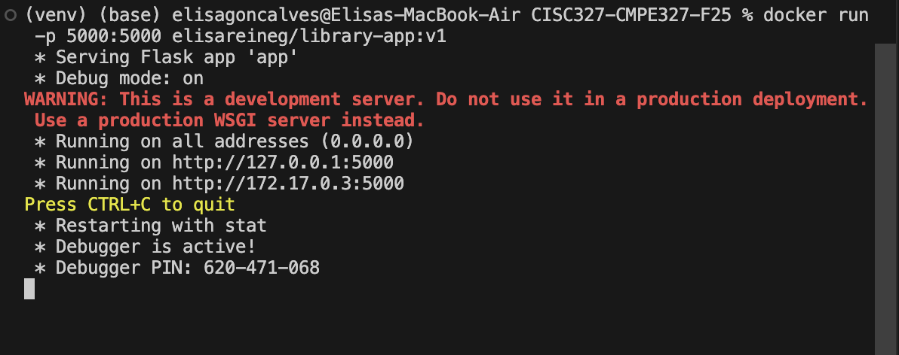
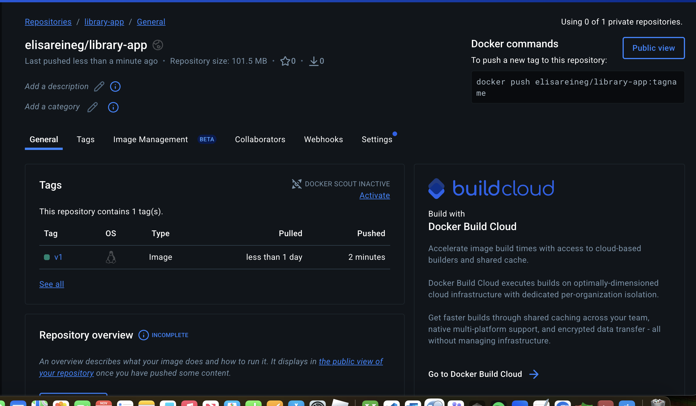
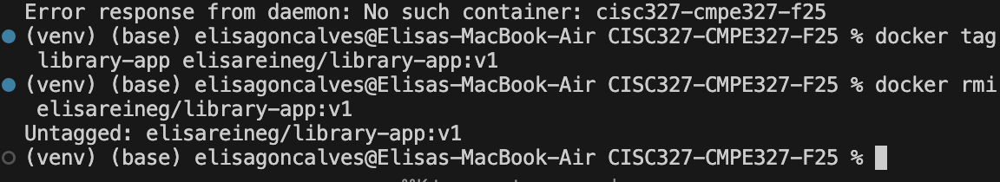

##### Elisa Goncalves

##### 20390874

##### Nov 24, 2025

## https://github.com/elisareineg/cisc327-library-management-a2-20390874

---

#### Part 1: E2E Testing

### 1. Installation Instructions

#### Step 1: Prerequisites

- Python 3.9 or higher
- pip (Python package manager)

#### Step 2: Install Dependencies

```bash
# Install Python packages
pip install -r requirements.txt

# Install Playwright browsers (required for E2E tests)
python -m playwright install chromium
```

---

### 2. Execution Instructions

#### Running E2E Tests

```bash
# Run all E2E tests (headless mode)
pytest tests/test_e2e.py -v

# Run E2E tests with visible browser window (headed mode)
pytest tests/test_e2e.py -v --headed

# Run specific E2E test (example)
pytest tests/test_e2e.py::test_add_book_to_catalog_and_verify -v

```

#### Running Docker Container

```bash
# Build the Docker image
docker build -t library-app .

# Run the container (maps port 5000 to host)
docker run -p 5000:5000 library-app

# Run in detached mode (background)
docker run -d -p 5000:5000 library-app

# Access the application
# Open browser to: http://localhost:5000
```

---

### 3. Test Case Summary

**test_add_book_to_catalog_and_verify**

- **Actions:** Navigate to catalog page → Click "Add New Book" → Fill form (title, author, ISBN, copies) → Submit form → Verify book appears in table
- **Expected Results:** Catalog page loads with heading "📖 Book Catalog", Add book page displays, Success flash message: "successfully added", Book appears in catalog table with correct details

**test_borrow_book_from_catalog**

- **Actions:** Navigate to catalog page → Find first book with borrow form → Enter 6-digit patron ID → Click "Borrow" button → Verify availability changes
- **Expected Results:** Catalog page loads, Borrow form visible, Success/error flash message appears, If successful: "Successfully borrowed [book title]" message and availability decreases by 1, If error: Appropriate error message displayed

**test_complete_add_and_borrow**

- **Actions:** Navigate to catalog → Add new book to catalog → Verify book appears → Borrow the newly added book → Verify borrow confirmation
- **Expected Results:** Book successfully added and visible, Success message for book addition, Borrow operation completes, Success message for borrowing, Both operations reflected in UI

**test_homepage_loads**

- **Actions:** Navigate to homepage (root URL) → Verify redirect
- **Expected Results:** Homepage redirects to `/catalog`, Catalog page heading visible, Page content loads correctly

---

### 4. E2E Testing Approach

For end-to-end testing, I used **Playwright (Python)** with the `pytest-playwright` plugin to automate browser-based testing of the Flask application. The E2E tests cover user flows including: (1) adding a new book to the catalog with form validation and verification that the book appears in the catalog table, (2) borrowing a book from the catalog using a patron ID and verifying flash messages and availability updates, (3) a complete end-to-end flow that adds a book and then borrows it, and (4) homepage navigation and redirect functionality.

Assertions are performed using Playwright's web-first assertion API (`expect()`) which automatically retries until conditions are met. The tests verify UI elements such as page headings, form submissions, flash success/error messages with proper CSS class selectors (`.flash-success`, `.flash-error`), table content including book details (title, author, ISBN), and availability changes after borrowing operations.

Each test uses a `flask_app_server` fixture that automatically starts a Flask server on a dynamically assigned port in a separate thread, ensuring test isolation with fresh database instances. The tests can run in both headless mode (default, faster for CI/CD) and headed mode (`--headed` flag, for debugging).

**Expected Test Output:**

```
============================= test session starts ==============================
platform darwin -- Python 3.12.2, pytest-7.4.4, pluggy-1.0.0
collecting ... collected 4 items

tests/test_e2e.py::test_add_book_to_catalog_and_verify[chromium] PASSED
tests/test_e2e.py::test_borrow_book_from_catalog[chromium] PASSED
tests/test_e2e.py::test_complete_add_and_borrow[chromium] PASSED
tests/test_e2e.py::test_homepage_loads[chromium] PASSED

============================== 4 passed in ~8s ===============================
```

---

### Part 2: Dockerization

## Dockerfile Overview

- **Base Image:** `python:3.11-slim`
- **Port:** Exposed port 5000
- **Database:** SQLite database automatically initialized on startup via `create_app()`
- **Security:** Runs as non-privileged user (`appuser`)

## Steps to Build and Run

**Step 1: Build the Docker Image**

```bash
docker build -t library-app .
```

This command:

- Pulls the Python 3.11 slim base image
- Installs dependencies from `requirements.txt`
- Copies application code
- Exposes port 5000
- Sets up the container to run the Flask app

**Step 2: Run the Container**

```bash
docker run -p 5000:5000 library-app
```

This command:

- Starts the container
- Maps container port 5000 to host port 5000
- The Flask app initializes the database automatically
- Application is accessible at `http://localhost:5000`

**Screenshots:**




### Docker Hub Deployment

## Step 1: Build and Tag Image for Docker Hub

```bash
docker build -t <dockerhub-username>/library-app:latest .
```

## Step 2: Login to Docker Hub

```bash
docker login
```

#### Step 3: Push to Docker Hub

```bash
docker push <dockerhub-username>/library-app:latest
```

**Screenshot - Successful Push:**



#### Step 4: Pull from Docker Hub

To pull and run the image from Docker Hub on any machine:

```bash
docker pull <dockerhub-username>/library-app:latest
docker run -p 5000:5000 <dockerhub-username>/library-app:latest
```

**Screenshot - Successful Pull:**


#### Step 5: Delete Local Image

To remove the local image:

```bash
docker rmi <dockerhub-username>/library-app:latest
```

**Screenshot - Successful Delete:**



---

### Challenges and Reflections

During this assignment, I encountered several challenges. The primary difficulty was setting up the Flask server fixture for E2E testing, particularly ensuring the server starts reliably across different environments, especially Windows CI runners. The server would sometimes fail to start, requiring me to implement some timeouts/delays. This taught me the importance of accounting for platform-specific timing differences in CI/CD environments.

Another challenge was designing tests to handle both success and error scenarios appropriately. For the borrow book functionality, the same test needed to validate the UI response whether the operation succeeded or failed (e.g., if a book was already borrowed or a patron reached the borrowing limit). This required checking the flash message class attribute to determine if it was a success or error, then asserting the appropriate message content and UI state changes accordingly. This approach ensures the tests validate that the application correctly displays error messages to users, not just successful operations, making the E2E tests more comprehensive and realistic.

Dockerization was relatively straightforward, but I learned about the importance of proper base image selection (using slim images for smaller size), security best practices (running as non-privileged user), and ensuring the application properly initializes its dependencies (database) so that it can run on any computer. The Docker Hub deployment process was relatively easy to do and reinforced the value of containerization for consistent deployments across different environments.

Overall, this assignment deepened my understanding of end-to-end testing practices, Docker containerization, and the importance of building cross-platform test suites that work reliably in both local development and CI/CD environments.
